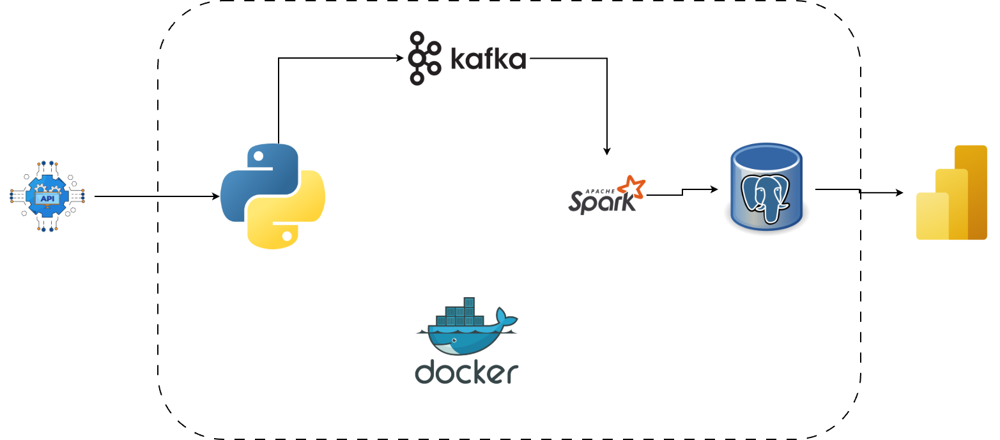

## Project Name: Real Time STock Market Analysis

# 📌 Project Overview

This project demonstrates how to design and implement a scalable data pipeline using modern data engineering tools.

## Architecture Flow
External API → Kafka → Spark → PostgreSQL → Power BI
                 ↑
               Docker

## Project Tech Stack and Flow
- `API – Data source (RapidAPI integration)`

- `Kafka – Real-time streaming ingestion`

- Spark – Distributed data processing

- PostgreSQL – Structured data storage

- Power BI – Business intelligence visualization

- Docker & Docker Compose – Containerized services

- Git & GitHub – Version control

### 🏗 System Architecture

1️⃣ Data Ingestion Layer

API integration using Python

Data serialized and sent to Kafka topic

2️⃣ Streaming Layer

Apache Kafka handles message streaming

Decouples data producer from consumer

3️⃣ Processing Layer

Spark consumes data from Kafka

Performs transformation and cleaning

Outputs structured data

4️⃣ Storage Layer

PostgreSQL stores processed data

Optimized schema for analytics

5️⃣ Visualization Layer

Power BI connects to PostgreSQL

Builds dashboards for business insights

# 📂 Project Structure
project-root/
│
├── app/
│   ├── main.py
│   ├── api_client.py
│   ├── producer.py
│   ├── consumer.py
│   ├── spark_processor.py
│   └── database.py
│
├── docker-compose.yml
├── Dockerfile
├── requirements.txt
└── README.md

Modularized code for maintainability

Separation of concerns across ingestion, processing, and storage

# 🐳 Docker Setup
Prerequisites

Docker

Docker Compose

Build & Run
docker-compose up --build

This will:

Build the application image

Start Kafka service

Start PostgreSQL service

Run the application container

To stop services:

docker-compose down

# 🔐 Environment Variables

Create a .env file:

API_KEY=your_rapidapi_key
POSTGRES_USER=your_user
POSTGRES_PASSWORD=your_password
POSTGRES_DB=your_database

⚙️ Technologies Used

Python

Apache Kafka

Apache Spark

PostgreSQL

Docker & Docker Compose

Power BI

Git & GitHub

# 🎯 Key Engineering Principles Applied

Modular code structure

Separation of concerns

Containerized environment

Reproducible infrastructure

Scalable architecture design

# ✅ Expected Output

Docker Compose builds successfully

Application runs inside container

Data flows from API → Kafka → Spark → PostgreSQL

Power BI dashboard reflects processed data

# 🚀 Future Improvements

Add logging & monitoring

Implement schema validation

Add CI/CD pipeline

Deploy to cloud (AWS / Azure / GCP)

Add orchestration with Airflow

👨🏽‍💻 Author

Adenuga Olajide
Data Engineering Journey – Building Scalable Systems in Public